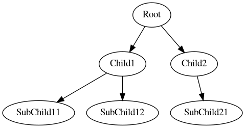

# Outmind

Produce a mind map from an outline.

## Usage
```
python3 outmind.py <outline_file>
```

## Recommended usage

I created this tool because I was dissatisfied with the available options for creating mind maps. Specifically, all mind mapping software I've tried so far is lacking in the following ways :
* Absent or poor automatic placement of nodes and edges (doing it manually is a pain)
* Editing the mind map is slow, usually due to absent or poor keyboard shortcuts

My recommended worfklow is therefore to open an outline in Vim and to register a command that runs outmind on file save. Open the resulting PDF using a viewer that has hot reloading capabilities, and voila. You can now **mind map at the speed of thought**.

## Outline format

The outline is assumed to describe a tree, with a single "root" element.
The indentation is assumed to be a single space per level.

### Valid outline
```
Root
 Child1
  Subchild11
  Subchild12
 Child2
  Subchild21
```

#### Output


### Invalid outline (two spaces for indentation instead of 1)
```
Root
  ChildTwoSpaces
```

## Todo

* Allow labeled edges
  * Implementation idea : edges can be indicated by a colon, e.g. `is:ordered` would create an edge labeled "is" to a node labeled "ordered"
* Relax requirement to have one-space indentation everywhere
  * Implementation idea : infer indentation and normalize to single space before passing to `outline_to_edges`
